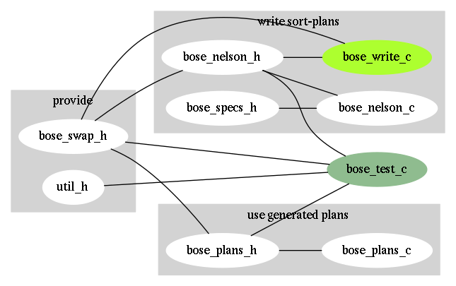

# BOSE-NELSON

**bose-plans.{c,h}** contain _optimal_ sort plans for _n_= 2..30

those are what you need as q/sort is much faster than driving a sort-network from
a plan generated in real time, so run your own tests, maybe with the code herein,
and decide how to trade object-code size for speed. 





This repo adds code-generation and a simple performance test to 
[Atin M's repo](https://github.com/atinm/bose-nelson) which provided the basic algo.

[The algo is 58+ yo]( https://dl.acm.org/doi/10.1145/321119.321126) and more
efficient strategies for sorting sets with _n_= 9..16 have been published in the
literature. I've processed, tested and incorporated those advances as published
on [J. Gamble's page](http://pages.ripco.net/~jgamble/nw.html).


Thank you guys! Your work helped me put this concept into production right away!


## Code samples

This is what the output looks like for _n_=5:
```
void sort_best_5(swap_fn_t swap) {
  swap(0, 1); swap(3, 4); swap(2, 4); swap(2, 3); swap(0, 3);
  swap(0, 2); swap(1, 4); swap(1, 3); swap(1, 2);
}
```

The 32/64 bit swap fn (pick one) is defined like this:
```
typedef void (*swap_fn_t)(int64_t i, int64_t j);
typedef void (*swap_fn_t)(int32_t i, int32_t j);
```

Use the generated code through _bose_sort()_:
```
#include "bose-plans.h"
int bose_sort(int n, swap_fn_t cmp_swap);
```


## Not even a makefile!?

compile _bose-test_ and print sort-plan for _n_=20
```
gcc util.c bose-nelson.c bose-plans.c bose-test.c -o bt && bt 20
```

the same, but show the brackets as part of the plan:
```
gcc -D mt_show_blocks util.c bose-nelson.c bose-plans.c bose-test.c -o bt && bt 20
```


compile _bose-test_ and compare times to sort _20_ items 1 million times:
```
gcc util.c bose-nelson.c bose-plans.c bose-test.c -o bt && bt 0
```

compile _bose-write_ and regen _bose-plans.c_ (coded with _n_=30)
```
gcc -g util.c bose-specs.h bose-nelson.c bose-write.c -o bw && bw
```


## The code is placed here with the following loose ends:

* There's no calibration seeking the point at which the nets loose to specialized
algos. Limits of 25 and 32 work for me with 64/32 bit pointers respectively. 

* The individual sort brackets generated by the algo could be using separate macros
and in order to let the generator drive sorting via (at least?) two threads.


## Contribute?

Absolutely!  assembler compare-and-swap implementations, nicer tests, calibration,
crazy variations, multi-thread hinted optimal plans, a tinycthread version, tips,
feedback, spelling and grammar corrections ... I'll be happy to take point.
