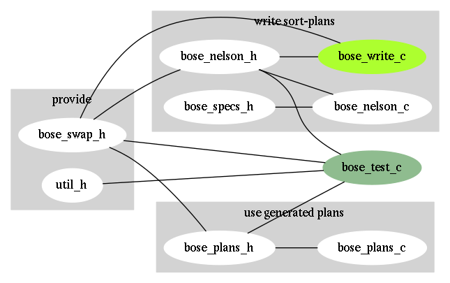

# BOSE-NELSON

**bose-plans.{c,h}** contain _optimal_ sort plans for _n_= 2..25

those are what you need as q/sort is much faster than driving a sort-network from
a plan generated in real time, so run your own tests, maybe with the code herein,
and decide how to trade object-code size for speed. 





This repo adds code-generation and a simple performance test to 
[Atin M's repo](https://github.com/atinm/bose-nelson) which provided the basic algo.

[The algo is 58+ yo]( https://dl.acm.org/doi/10.1145/321119.321126) and more
efficient strategies for sorting sets with _n_= 9..16 have been published in the
literature. I've processed, tested and incorporated those advances as published
on [J. Gamble's page](http://pages.ripco.net/~jgamble/nw.html).


Thank you guys! Your work helped me put this concept into production right away!


## Code samples

This is what the output looks like for _n_=5:
```
void sort_best_5(swap_fn_t swap) {
  swap(0, 1); swap(3, 4); swap(2, 4); swap(2, 3); swap(0, 3);
  swap(0, 2); swap(1, 4); swap(1, 3); swap(1, 2);
}
```

The 32/64 bit swap fn (pick one) is defined like this:
```
typedef void (*swap_fn_t)(int64_t i, int64_t j);
typedef void (*swap_fn_t)(int32_t i, int32_t j);
```

The generated code interfaces via 2 variables through its constructor:
```
#include "bose-plans.h"

sort_best* sort_best_fns;
int sort_best_fns_n;
```

To sort, call the fn for _n_ like this:
```
  sort_best_fns[n](sort_swap);
```

##### The code is placed here with the following loose ends:

* The generated code lacks a bose-sort() that errors out or falls back on qsort
when you're asking it to sort something outside of the range 2..25.

* There's also no 'auto-determination' to decide if that current upper limit of 25
is simply too low. Example, for sorting 32 bit values, a limit of 32? would work.

* The individual sort brackets generated by the algo could be using separate macros
in order to let the generator drive multi threaded sorting. Not too hard, but I
lack the cores and need to develop that atm.


